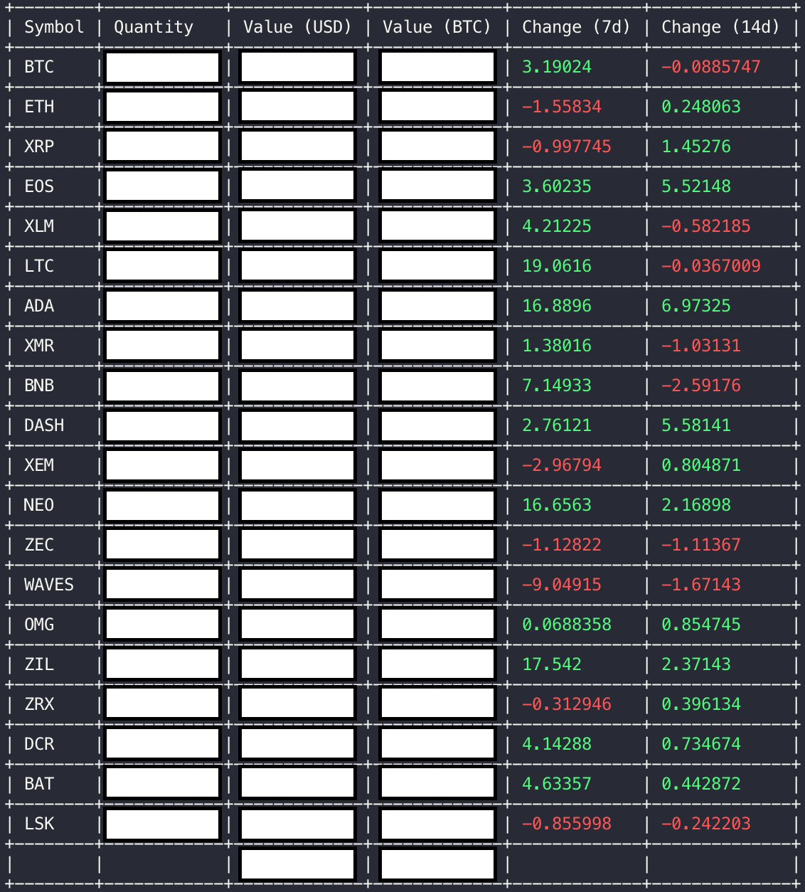
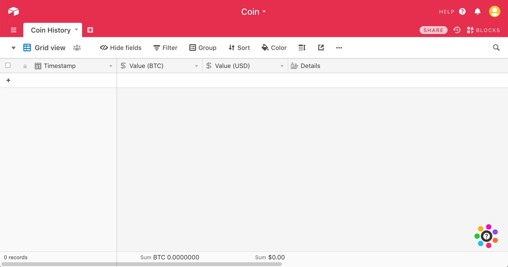

# coin

A cryptocurrency management and market indexing command line tool.

# Quick start

Coin is a simple to use tool for managing cryptocurrency indexes. In a single command, you can have coin automatically balance and execute a market cap weighted index using your personal binance account.

The `coin` CLI depends on coinmarketcap.com and coinmetrics.io for historical market data and exchange independent prices as well as the binance API to execute trades. You do not need an account for coinmetrics.io, but you will need to supply API keys for your CoinMarketCap and Binance accounts.

Get started with these steps.

**Install coin**

Download the executable for your platform from the releases tab and add it to your path.

```bash
# Add this to your .bash_profile, .zshrc, .bashrc, etc.
export PATH="/Users/username/tools/coin:$PATH"
```

**Create a CoinMarketCap API key**

Go here and create a free key: https://coinmarketcap.com/api/

**Create a Binance API key**

Go to https://binance.com and click the link on the home page once you have logged in to create an API key. Make sure you give the key permission to read as well as trade.

**Configure coin via ~/.coin.yaml**

Create the config file named `coin.toml` in your home directory i.e. `~/.coin.toml`.

```toml
# You may add currencies to the blacklist and coin will never buy them.
blacklist = [
  'TRX',
  'BCH',
  'BSV',
  'BCHABC',
  'BCHSV'
]

[binance]
key = 'your-binance-api-key-with-read-and-trading-enabled'
secret = 'your-binance-api-secret-with-read-and-trading-enabled'

[cmc]
key = 'your-free-coin-market-cap-key'
```

**Test things are working**

```bash
coin account
```



# Features

## Print positions, values, and recent changes

```bash
coin account
```

## Balance your portfolio

This is the meat of the coin CLI. Running balance will exit all positions into a base currency,
BTC by default, and then calculate a market cap weighted portfolio based off the exponential
moving averages of the underlying market caps. You can control the variables of the moving
average and the size of the index via arguments.

```bash
coin balance --base BTC --size 20 --lookback 20 --factor .3 --mock
```

* --base - The base currency to use. Currently only BTC is officially supported.
* --size - The number of assets to include in the index. This defaults to 20 but can change depending on preference.
* --lookback - The number of days to lookback for the moving average calculations.
* --factor - The smoothing factor. The smaller this number, the more smooth the moving average.
* --mock - Use this flag to see what the balance would do without executing any trades. Remove it to execute the trades.

## Save record of your portfolio

When enabled, the coin CLI will write a record to an **airtable** table everytime your portfolio is balanced.
You can also manually save a snapshot of your portfolio using `coin save`. To enable airtable support,
create an airtable table that looks like the one below at https://airtable.com.



> You may change the name of the table and names for the columns using the ~/.coin.toml config file.

After creating your table, go to the airtable docs and select your base here https://airtable.com/api.
Once you have the API docs open for your base containing the "Coin History" page, click "Authentication"
on the left sidebar and check the "Show API key" checkbox in the top right of the page. Now on the right
side of the page you should see an example curl command for your API that looks like this:

```
curl https://api.airtable.com/v0/appxfhwlEmDOSkenF/Coin%20History \
-H "Authorization: Bearer keyn2je4nMDH3ySld"
```

The part of the url that starts with **appx** and the string in the header that starts with **keyn**
will be used to configure airtable in your `~/.coin.toml`.

```toml
[airtable]
key = 'keyn-airtable-api-key'
app = 'appx-airtable-app-id'
table = 'Coin History'
# Use whatever you named your table in airtable

# Optionally customize column names.
# What you see below is the default.
[airtable.column_map]
total_btc = 'Value (BTC)'
total_usd = 'Value (USD)'
details = 'Details'
timestamp = 'Timestamp'
```

Test your airtable config by running:

```bash
coin save
```

You portfolio will automatically be saved when you run `coin balance` from now on.

## Exit the market

The exit command allows you to sell all assets into a single base currency. If you provide a -p (--position)
then only that single position will be sold.

```bash
# Sell all assets into BTC
coin exit

# Sell all ETH into BTC
coin exit -b BTC -p ETH
```

## Entering markets

The enter command allows you to execute market orders for currency pairs.

```bash
# Buy as much ETH as I can using BTC
coin enter -p ETH

# Buy as much BNB as I can using ETH
coin enter -p BNB -b ETH

# Buy as much ETH as I can with .1 BTC
coin enter -p ETH -b BTC -a .1
```

## Print CoinMarketCap prices

```bash
coin cmc
```

## Print binance prices

```bash
coin binance
```